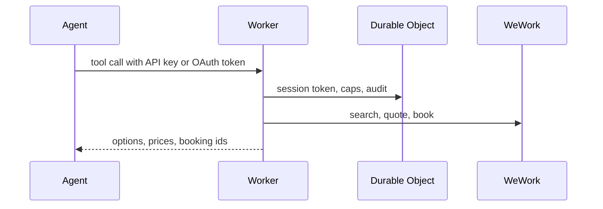

# weworking

Lets an AI agent book your WeWork desk. I have an All Access membership, and every morning my agent reads my calendar, works out which building makes sense for the day, and books a desk there. This is the small Cloudflare Worker that makes that possible: it talks to WeWork with your own account and exposes six tools over MCP that any agent can use.

Unofficial. Not affiliated with WeWork. It uses the same private endpoints the WeWork web app uses, they can change without notice, and you are responsible for your own account and for WeWork's terms. See [the threat model](docs/THREAT_MODEL.md) before deploying.

## Get started

**1. Deploy.**

[](https://deploy.workers.cloudflare.com/?url=https://github.com/jitpal/weworking)

The button clones this repo into your GitHub, creates the storage it needs, asks for the three required secrets, and deploys. Or from a terminal:

```sh
git clone https://github.com/jitpal/weworking.git && cd weworking && npm install
npx wrangler login
npx wrangler kv namespace create OAUTH_KV       # put the printed id in wrangler.local.jsonc
cp wrangler.jsonc wrangler.local.jsonc
npx wrangler secret put ADMIN_PASSWORD           # your sign-in for the admin pages
npx wrangler secret put QUOTE_SIGNING_KEY        # openssl rand -hex 32
npx wrangler secret put COOKIE_SIGNING_KEY       # openssl rand -hex 32, a different one
npm run deploy
```

**2. Connect WeWork.** Open `https://<your-worker>/admin` and sign in. Either set `WEWORK_USERNAME` and `WEWORK_PASSWORD` as secrets so the Worker signs in by itself, or, if your WeWork account has two-factor authentication or you would rather not store the password, paste a session: sign in to WeWork in your browser, click the bookmarklet from the connect page, paste. It takes a minute and lasts for weeks.

**3. Give your agent access.** Create an API key on `/admin/keys` and add the server:

```sh
claude mcp add --transport http weworking https://<your-worker>/mcp \
  --header "Authorization: Bearer ww_..."
```

Or use OAuth instead of a key. Run the same command without the header and approve it in the browser. claude.ai and ChatGPT connectors only support OAuth. Other clients: [docs/CLIENTS.md](docs/CLIENTS.md).

**4. Ask.** "Find me a desk near Times Square on Tuesday." "Book the first one." "What do I have booked this week?"

## Safety

An agent with access to this can spend your money, so the defaults assume the worst and you loosen them on purpose.

- **It can only book what it just showed you.** Search returns a signed quote for each option and booking accepts nothing but that quote. The price you saw is the price re-checked at booking time, and a quote dies after ten minutes.
- **One desk a day, seven a week, and nothing that costs money.** All Access desks are free, so those go through. A second desk on the same day costs a credit and is refused. Cash bookings on pay-as-you-go plans are refused until you set `MAX_CASH_PER_BOOKING`. All four limits live in `wrangler.jsonc` and the Durable Object enforces them, not the agent.
- **Keys are scoped and revocable.** A `read` key can search but never book. Revoke any key with one click on `/admin/keys`. Only a hash of each key is stored.
- **Your credentials never reach the model.** The WeWork session lives in a Durable Object in your own Cloudflare account. No tool result, error, or log line contains it.
- **A kill switch and an audit log.** `WRITE_ENABLED=false` makes the whole deployment read-only in one deploy. Every search, booking, and cancellation is recorded on `/admin/audit`.
- **The agent is told the rules.** The server's instructions and the [bundled skill](skills/book-a-desk/SKILL.md) say: show the cost, get a yes, never retry a booking blindly, and remind the user that a booking can be cancelled free until 11:59pm the day before.

## How it works

You deploy the Worker to your own Cloudflare account. The agent authenticates to the Worker, the Worker holds your WeWork session in a Durable Object, and every tool call becomes requests to WeWork on your behalf.



Six tools: `whoami`, `list_locations`, `search_availability`, `create_booking`, `list_bookings`, `cancel_booking`. The typical flow is `search_availability` by city, coordinates, or building, show the user the options with prices, get a yes, `create_booking` with the quote. A REST mirror lives under `/api` with an OpenAPI document. Details in [docs/API.md](docs/API.md).

## What it does not do

- Meeting rooms and private offices. Hot desks only.
- More than one WeWork account per deployment. This is by design.
- Automatic sign-in for accounts with two-factor authentication. Paste a session instead.

## Docs

[Self-hosting and troubleshooting](docs/SELF_HOSTING.md) · [Connecting clients](docs/CLIENTS.md) · [API reference](docs/API.md) · [Location and time rules](docs/LOCATION_AND_TIME.md) · [Threat model](docs/THREAT_MODEL.md) · [Security policy](SECURITY.md)

## A personal project

This is built for my own use and shared as is. Issues are off and pull requests are closed automatically. Fork it and change whatever you like; the license allows it. Security problems can still be reported privately, see [SECURITY.md](SECURITY.md).

## Thanks

The request flow follows [dvcrn/wework-cli](https://github.com/dvcrn/wework-cli), the reference implementation for the WeWork login and booking sequence, with details from [hotdesker](https://github.com/SridarDhandapani/hotdesker) and [jeromewir/webook](https://github.com/jeromewir/webook). None are affiliated with this project.

MIT. See [LICENSE](LICENSE).
