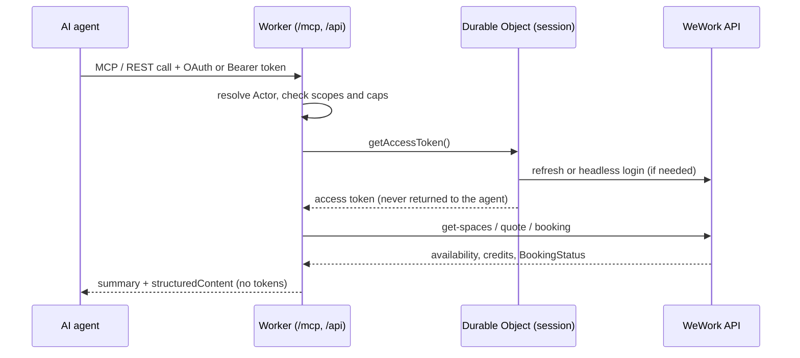

# weworking

`weworking` is an unofficial, self-hostable Cloudflare Worker that lets an AI agent find and book WeWork hot desks on your behalf. It exposes the same capabilities twice: as a remote MCP server (Streamable HTTP at `/mcp`) for agent clients like Claude Code, Claude Desktop, claude.ai and ChatGPT, and as a plain REST API under `/api/*`. Both front doors are protected by OAuth 2.1 and by static scoped bearer tokens. Your WeWork session lives in a single SQLite Durable Object inside your own Cloudflare account and never reaches the model.

## Unofficial. Read this first

> - This project is **not affiliated with, authorised by, or endorsed by WeWork**. "WeWork" is used only to describe what the software talks to.
> - It drives **undocumented internal endpoints** of `members.wework.com`. They can change or disappear at any time, without notice, and then this stops working.
> - **You are responsible** for your own WeWork account, for the credits it spends, and for complying with WeWork's terms of service and any agreement your employer has with them. Automated booking may violate those terms. Decide that for yourself before deploying.
> - Provided **without warranty of any kind**. If an agent books the wrong desk, burns your monthly credits, or gets your account flagged, that is on you. See [LICENSE](LICENSE).
> - One deployment serves **one WeWork account**, yours. Do not run it as a shared service for other people's accounts.

## How it works

You deploy the Worker to your own Cloudflare account. An agent authenticates to the Worker (OAuth 2.1 or a static bearer token), the Worker asks its Durable Object for a valid WeWork access token, and calls the WeWork API with it. The agent only ever sees desk options, credit costs, and booking ids.



## Features

Six MCP tools, mirrored by REST routes:

| Tool | What it does |
| --- | --- |
| `whoami` | profile, credit balance, session state, your scopes, caps, write kill-switch state |
| `list_locations` | search WeWork buildings by city, text, or lat/lng radius |
| `search_availability` | hot desks for a date/time window; each result carries a signed `quote` |
| `create_booking` | books a desk from a quote; supports `dry_run` and `idempotency_key` |
| `list_bookings` | upcoming (and optionally past) bookings |
| `cancel_booking` | cancels by booking id |

Safety rails, because this spends real money:

- **Signed quotes.** `create_booking` accepts only an HMAC-SHA-256 signed `quote` produced by `search_availability` (10 min TTL by default). An agent cannot invent a booking out of free-text parameters.
- **Idempotency.** `idempotency_key` on writes; replays return the original result instead of double-booking.
- **Daily and weekly caps.** `MAX_BOOKINGS_PER_DAY`, `MAX_BOOKINGS_PER_WEEK`, and an optional `MAX_CREDITS_PER_BOOKING` ceiling, enforced in the Durable Object.
- **`dry_run`.** Validates the quote, caps, and availability and returns the exact booking it *would* make, without calling WeWork's booking endpoint.
- **Read/write scopes.** Tokens are scoped `read`, `write`, `admin`. A `read`-only token cannot book or cancel.
- **Audit log.** Every tool call is recorded (actor, tool, redacted args, outcome, booking id, credits) and readable at `/admin/audit`.
- **Write kill switch.** `WRITE_ENABLED="false"` makes the whole deployment read-only in one `wrangler deploy`.

## Quick start (self-hosting)

You need a Cloudflare account (the free plan is enough), Node 22, and a WeWork account with hot-desk credits. Longer version with troubleshooting: [docs/SELF_HOSTING.md](docs/SELF_HOSTING.md).

```sh
git clone https://github.com/<you>/weworking.git
cd weworking
npm install
```

Create the KV namespace the OAuth provider needs, then paste the printed id into the `OAUTH_KV` binding in `wrangler.jsonc` (it ships as a `REPLACE_ME...` placeholder):

```sh
npx wrangler kv namespace create OAUTH_KV
```

Set the secrets. Each line prompts for a value:

```sh
npx wrangler secret put ADMIN_PASSWORD      # gates /admin/* and the OAuth approval screen
npx wrangler secret put QUOTE_SIGNING_KEY   # HMAC key that signs booking quotes
npx wrangler secret put COOKIE_SIGNING_KEY  # signs the admin session cookie
npx wrangler secret put AUTH_TOKENS         # optional: JSON array of static scoped tokens
npx wrangler secret put WEWORK_USERNAME     # optional: for automatic login
npx wrangler secret put WEWORK_PASSWORD     # optional: for automatic login
```

Generate the two random keys with:

```sh
openssl rand -hex 32
```

Deploy and check it:

```sh
npm run deploy
open https://<your-worker>.workers.dev/healthz
```

`/healthz` is public and secret-free; it reports which secrets are present and the session state.

### Connect WeWork

Two options. You only need one.

1. **Automatic login.** Set `WEWORK_USERNAME` and `WEWORK_PASSWORD`. The Worker logs in itself on first use and keeps a refresh token. Auth0's bot detection may refuse logins from Cloudflare's datacenter IPs (you will see `UPSTREAM_BLOCKED`), and accounts with MFA cannot use this path.
2. **Paste a session.** Open `https://<your-worker>.workers.dev/admin/connect`, sign in with `ADMIN_PASSWORD`, and follow the on-page instructions to copy your live session from `members.wework.com` and paste it in. Access tokens last about 12 hours but come with a refresh token, so you do this once and then at most monthly.

Try option 1 first if you are comfortable storing your WeWork password as a Worker secret. Option 2 always works and is the only path for MFA accounts. Both land in the same session store, and the Worker refreshes the token itself from then on.

## Connecting agents

Full per-client detail, including Claude Desktop and the OpenAI Agents SDK: [docs/CLIENTS.md](docs/CLIENTS.md).

**Claude Code**, with OAuth (opens a browser, you approve with `ADMIN_PASSWORD`):

```sh
claude mcp add --transport http weworking https://<your-worker>.workers.dev/mcp
```

or with a static token instead:

```sh
claude mcp add --transport http weworking https://<your-worker>.workers.dev/mcp \
  --header "Authorization: Bearer <token>"
```

**Cursor**, in `~/.cursor/mcp.json` (or `.cursor/mcp.json` in a project):

```json
{
  "mcpServers": {
    "weworking": {
      "url": "https://<your-worker>.workers.dev/mcp",
      "headers": { "Authorization": "Bearer <token>" }
    }
  }
}
```

**claude.ai**: Settings > Connectors > Add custom connector, URL `https://<your-worker>.workers.dev/mcp`. OAuth only. It walks you through the approval screen.

**ChatGPT**: developer mode > add MCP server, same URL. OAuth only.

**REST**:

```sh
curl -s -H "Authorization: Bearer <token>" \
  "https://<your-worker>.workers.dev/api/availability?city=London&date=2026-09-21&start_time=09:00&end_time=17:00"
```

## Static tokens

`AUTH_TOKENS` is a JSON array of entries. Only the SHA-256 hash of each token is stored, so the secret is not itself a credential:

```json
[
  { "name": "claude-code", "sha256": "9f86d081...", "scopes": ["read", "write"] },
  { "name": "dashboard",   "sha256": "5e884898...", "scopes": ["read"] }
]
```

Generate a token and its entry with:

```sh
node scripts/hash-token.mjs --name claude-code --scopes read,write
```

It prints the token once (copy it then, it is not recoverable) and the JSON entry to merge into `AUTH_TOKENS`. Then `npx wrangler secret put AUTH_TOKENS` with the full array.

## Configuration

Secrets (`npx wrangler secret put <NAME>`, or `.dev.vars` locally, see `.dev.vars.example`):

| Secret | Required | Purpose |
| --- | --- | --- |
| `ADMIN_PASSWORD` | yes | gates `/admin/*` and the OAuth approval screen |
| `QUOTE_SIGNING_KEY` | yes | HMAC-SHA-256 key for booking quotes; 32+ random bytes hex |
| `COOKIE_SIGNING_KEY` | yes | signs the admin session cookie |
| `AUTH_TOKENS` | no | JSON array of `{name, sha256, scopes}` static bearer tokens |
| `WEWORK_USERNAME` | no | WeWork login email, for automatic login |
| `WEWORK_PASSWORD` | no | WeWork password, for automatic login |

Vars (plain values in `wrangler.jsonc`, edit and redeploy):

| Var | Default | Purpose |
| --- | --- | --- |
| `WRITE_ENABLED` | `"true"` | `"false"` makes the deployment read-only |
| `MAX_BOOKINGS_PER_DAY` | `"1"` | per-day booking cap |
| `MAX_BOOKINGS_PER_WEEK` | `"5"` | per-week booking cap |
| `MAX_CREDITS_PER_BOOKING` | `"0"` | credit ceiling per booking; `0` = unlimited |
| `QUOTE_TTL_SECONDS` | `"600"` | how long a signed quote stays valid |
| `LOGIN_STRATEGY` | `"auto"` | `auto` \| `headless` \| `manual` (manual = never attempt login) |
| `PUBLIC_BASE_URL` | `""` | override the public origin used in OAuth metadata and hints |

Bindings: `SESSION` (Durable Object `WeWorkSession`, SQLite), `OAUTH_KV` (KV), plus a daily cron at `17 5 * * *` that refreshes the session and prunes old records.

## Safety model

Tokens are the boundary. WeWork access tokens and refresh tokens live only in the Durable Object; they are never returned by a tool, never placed in a response body, and never logged. All log output goes through a redactor. The agent holds only a Worker credential, and what that credential can do is bounded by its scopes: `read` can search and list, `write` can book and cancel within the caps, `admin` can read the audit log and replace the session. Every write additionally needs a fresh signed quote, passes the daily/weekly caps, and is written to the audit log. `WRITE_ENABLED="false"` revokes all write capability instantly. Full analysis: [docs/THREAT_MODEL.md](docs/THREAT_MODEL.md).

## Known limitations

- **Hot desks only.** `space_type` exists in every schema and meeting rooms and private offices are planned, but the booking payloads for them are not captured yet. You can help: [docs/CAPTURE_GUIDE.md](docs/CAPTURE_GUIDE.md).
- **Auth0 bot detection.** Automatic login from Cloudflare's IPs can be refused with a verification or captcha requirement (`UPSTREAM_BLOCKED`). There is no headless workaround. Use `/admin/connect`.
- **MFA accounts cannot use automatic login.** Use `/admin/connect`.
- **API churn.** These endpoints are internal and undocumented; WeWork renames parameters without warning (it happened in August 2026). When something breaks, open an `api_change` issue with a redacted HAR.
- **One account per deployment.** Multi-account is out of scope; there is an `accountId` seam but it is fixed to `"default"`.

## Project layout

```
src/                Worker source
  core/             domain types, quote signing, booking service, time helpers
  wework/           upstream client, Auth0 login/refresh, mappers
  session/          WeWorkSession Durable Object, token store, cron
  auth/             OAuth provider wiring, static token guard, admin session
  mcp/              MCP server and tool definitions
  http/             REST API, OpenAPI, admin pages, healthz
test/               vitest (workers pool) + scrubbed fixtures
docs/               self-hosting, clients, API, threat model, capture guide
plugin/             Agent Plugin (plugin.json, mcp.json, skills/)
scripts/            hash-token.mjs, record-fixture.mjs
```

## Development

```sh
npm run dev     # wrangler dev, reads .dev.vars
npm run check   # biome check + tsc --noEmit + vitest run
```

Tests never touch the network; upstream responses come from `test/fixtures/`. See [CONTRIBUTING.md](CONTRIBUTING.md).

## Related projects

This project follows the request flow published by **[dvcrn/wework-cli](https://github.com/dvcrn/wework-cli)** and **[dvcrn/mcp-server-wework](https://github.com/dvcrn/mcp-server-wework)**. They are the reference implementations for the Auth0 login and booking sequence, and the main reason this was possible at all. Also useful: **[SridarDhandapani/hotdesker](https://github.com/SridarDhandapani/hotdesker)** (Chrome extension, the most current endpoint details, including `inventory-details`) and **[jeromewir/webook](https://github.com/jeromewir/webook)** (refresh-token handling and rate limiting). None of these are affiliated with this project.

## Contributing and security

- [CONTRIBUTING.md](CONTRIBUTING.md): dev setup, commit style, fixtures
- [SECURITY.md](SECURITY.md): report a vulnerability privately
- [CODE_OF_CONDUCT.md](CODE_OF_CONDUCT.md)

## License

MIT. See [LICENSE](LICENSE).
